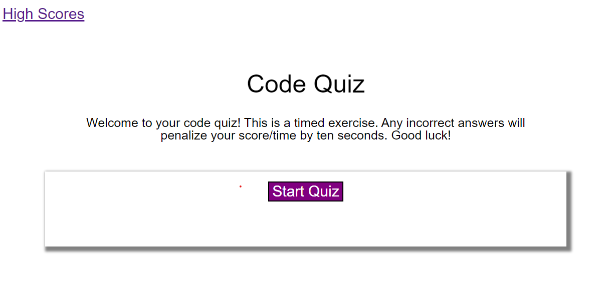

# Code Quiz

## Description 
The goal of this project was to was to create a code quiz, which displayed questions, and upon user selection, rendered a correct or incorrect answer. User score was calculated by subtracting 10 seconds from the timer for every incorrect response. Scores were stored and displayed on the High Score page. 

## Site Image

To visit the site click [here](https://samanthajanedavidson.github.io/code-quiz/). 

## License
Please refer to the license in the repo. 